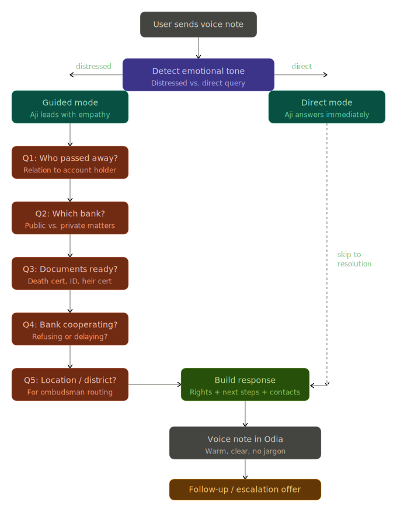

# 👵 Project Aji (ଅଜି)

### *Bridging the Bureaucracy Gap with Empathy & Voice*

[](#)
[](https://sarvam.ai)
[](#)

**Aji** (meaning *Grandmother* in Odia) is a voice-first WhatsApp assistant designed to ensure that no citizen ever has to endure the trauma of physical verification for banking and government services during times of grief.

Inspired by the tragic incident in Odisha where [a man had to carry his sister&#39;s remains to a bank](https://www.bbc.com/news/articles/clypl5jrjqlo), **Aji** acts as a native-language bridge between complex bureaucratic requirements and marginalized citizens.

---

## 🌟 The Core Vision

The goal is to move the burden of proof from the **individual** to the **infrastructure**.

* **Voice-First:** No typing required. Talk to Aji in your native Odia dialect.
* **Zero-Trust Identity:** Secure verification via bank-generated single-purpose tokens (V2 feature).
* **Strictly Informational:** Designed for guidance and document verification only—not for financial transactions.

---

## 🛠️ The Tech Stack (2026 Vibe-Code)

| Layer                    | Technology                | Purpose                                                |
| :----------------------- | :------------------------ | :----------------------------------------------------- |
| **Speech-to-Text** | `Sarvam Saaras v3`      | Understanding code-mixed Odia and English.             |
| **Brain (LLM)**    | `Sarvam-M`              | Empathetic reasoning and local legal context.          |
| **Text-to-Speech** | `Sarvam Bulbul v3`      | Delivering help in the warm, human "Roopa" voice.      |
| **Interface**      | `WhatsApp Business API` | Reaching users on the app they already know and trust. |
| **Backend**        | `Python / FastAPI`      | Fast, lightweight orchestration.                       |

---

## 🚀 How It Works (The Flow)

1. **Trigger:** A user in distress sends a voice note to the Aji WhatsApp number.
2. **Processing:** `Saaras` transcribes the audio; `Sarvam-M` parses the emotional intent and identifies the bureaucratic roadblock.
3. **The Guardrail:** Aji checks for a "Verification Token" (linked to the bank app) to ensure the user is who they say they are.
4. **Empathy Response:** Aji explains the user's rights (e.g., Doorstep Banking, Digital Attestation) and guides them through the next steps in a comforting Odia voice note.

### AJI Conversation Flow



## 💻 Quick Start (Prototype Setup)

### 1. Prerequisites

* Python 3.10+
* A [Sarvam AI](https://sarvam.ai) API Key.

### 2. Installation

```bash
git clone https://github.com/your-repo/project-aji.git
cd project-aji
pip install -r requirements.txt
```

### 3. Running the Prototype

```python
# Create a .env file with your API key
SARVAM_API_KEY=your_key_here

# Run the empathy engine
python aji_brain.py --input test_audio.wav
```

---

## 🛡️ Safety & Ethics

* **Data Sovereignty:** All processing happens via Sarvam AI’s sovereign Indian infrastructure.
* **Privacy by Design:** Aji does not store PII (Personally Identifiable Information). It only facilitates the verification handshake.
* **No Money Access:** The bot is hard-coded to ignore any requests related to fund transfers or PIN changes.

---

## 🤝 Contributing

We believe tech should serve the most vulnerable first. If you are a developer, linguist (Odia), or legal expert, please contribute to our **Empathy Mapping** or **Local Law Database**.

---

## 📄 License

This project is licensed under the **MIT License** - see the [LICENSE](LICENSE) file for details. Built for the public good.

---
